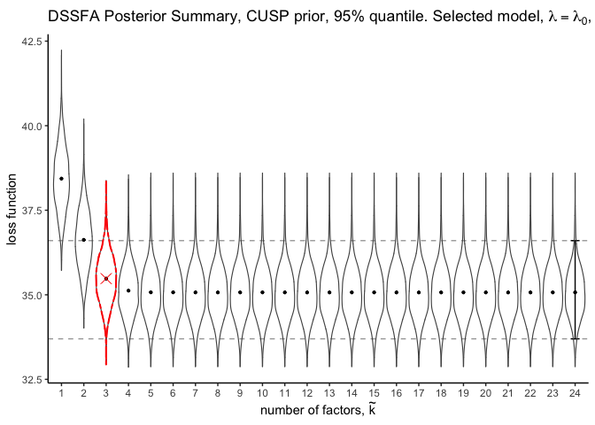

# Tutorial Personality data

This tutorial contains R code to perform the analysis of the subset of
the personality data in the paper “Decoupling Shrinkage and Selection in Gaussian Linear Factor Analysis”. 
We recommend to execute the code below in the
order in which it is presented, but changes can be made.

Setup and data uploading
------------------------

Before starting the analysis, set the working directory to the location
where you saved the file containing the source codes:

-   [`DSSFA_function_cov.R`](https://github.com/hbolfarine/dssfa/blob/master/R_codes/DSSFA_function_cov.R)
-   [`DSSFA_summary_plot.R`](https://github.com/hbolfarine/dssfa/blob/master/R_codes/DSSFA_summary_plot.R)
-   [`DSSFA_sel_mat.R`](https://github.com/hbolfarine/dssfa/blob/master/R_codes/DSSFA_sel_mat.R)

We use the `infinitefactor` package to generate samples for the MPG
prior, and for the CUSP prior we used the function [`cusp.R`]("https://github.com/siriolegramanti/CUSP/blob/master/cusp.R").
Once this has been done, load the indicated useful R packages.

```r
rm(list=ls())

# DSSFA Function, EFA Gibbs 
library(Rcpp)
library(inline)
library(fanc)
library(tidyr)
library(dplyr)
library(RColorBrewer)
library(latex2exp)
library(ggplot2)
library(reshape2)

# devtools::install_github("thomasp85/patchwork")
library(patchwork)

library(infinitefactor) # MGP prior
library(psych) # data

source("cusp.R") # CUSP prior
source("DSSFA_function_cov.R") # DSSFA function for covariance posterior
source("DSSFA_summary_plot.R") # DSSFA summary plots
source("DSSFA_sel_mat.R") # Select DSSFA point estimates given credible interval 
```
Upload data
-----------

For the data analysis, we follow and explore a subset of the big five
personality trait data, which is available at on the package . We
explore the association structure among *p* = 25 personality items
collected from *n* = 126 individuals with ages above 50. We follow and
scale the data and change the sign of the variables 1, 9, 10, 11, 12, 22
and 25.
```r
data(bfi)
bfi <- na.omit(bfi)
bfi <- bfi[which(bfi$age>50),1:25]
bfi[,1] <- -bfi[,1]
bfi[,9] <- -bfi[,9]
bfi[,10] <- -bfi[,10]
bfi[,11] <- -bfi[,11]
bfi[,12] <- -bfi[,12]
bfi[,22] <- -bfi[,22]
bfi[,25] <- -bfi[,25]

# Centered data
for (j in 1:25){
bfi[,j] <- (bfi[,j]-mean(bfi[,j]))
}

y = as.matrix(bfi)
S = cor(y)
Omega.data = (t(y)%*%y)/dim(y)[1]
```

Inference with CUSP prior
-------------------------

The Gibbs algorithm is run for 10,000 iterations discarding the first
5,000 as burn-in and with thinning in every five samples.

```r
# Gibbs sampler for the CUSP prior.
gibbs <- cusp_factor_adapt(y,my_seed=6784,N_sampl=15000,
                          alpha=5,a_sig=1,b_sig=0.3,a_theta=2,b_theta=2,theta_inf=0.05,
                          start_adapt=500,Hmax=dim(y)[2]+1,alpha0=-1,alpha1=-5*10^(-4))
```

Preparing the data from the posterior samples.

```r
# Number of variables
p = dim(gibbs$y)[2]

# Burn in for CUSP
burn_in = 5000

# Thinning
thin = 5
thinning = seq(burn_in+1,gibbs$N_sampl,by=thin)

# Posterior sample of the covaraince matrix
Omega_post = array(NA,c(p,p,length(thinning)))

# Squared error beteween the sample correlation and the posterior correlation.
cor.SE    = array(dim=dim(Omega_post))

# Distribution of the mean squared error of the correlation matrix.
MSE.cor   = numeric(length(thinning))

for(i in 1:length(thinning)){
  Omega_post[,,i] = gibbs$Lambda_post[[thinning[i]]]%*%t(gibbs$Lambda_post[[thinning[i]]])
                    +diag(1/gibbs$inv_sigma_sq_post[,thinning[i]])
  S_post          = diag(1/sqrt(diag(Omega_post[,,i])))%*%Omega_post[,,i]%*%diag(1/sqrt(diag(Omega_post[,,i])))
  cor.SE[,,i]     = (S_post-S)^2
  MSE.cor[i]      = mean(cor.SE[,,i][upper.tri(cor.SE[,,i],diag=TRUE)])
}
```
The mean and 95% quantile of the number of factors from the loadings
after burn in and thinning.
```r
mean(gibbs$Hstar[thinning])
## [1] 2.65

quantile(gibbs$Hstar[thinning],probs = c(0.025,0.975))
##  2.5% 97.5% 
##     2     3
```
From the posterior samples obtained by the Gibbs sampler, we create an
object used in the optimization step. This object contains the number of
variables, posterior loadings, posterior uniqueness, prior choice, the
final number of simulations, and thinning.
```r
obj = list()

# Number of variables in the sample
obj$P = p

# Sample size.
obj$samp.size = length(thinning)

# Posterior sample covariance matrix.
obj$post.cov = Omega_post

# Prior information
obj$prior.bfa = "CUSP"

# Posterior sample size.
obj$nsim = 2000

#thinnig has already been done
obj$thin = 1 
```
From the same posterior samples generated by CUSP, we initialized our
method with *k*<sub>dssfa</sub> = *p* − 1 factors for the two methods.
This limit is imposed by the optimization procedure. We let our method
automatically select the factor dimension under 95% credible intervals,
and no regularization was used.
```r
# Size of the solution path, length 2 gives length 0 
lambda.length = 2

# DSSFA under CUSP prior
obj.bfa.list.CUSP = dssfa.cov(obj, length.lambda = lambda.length, k.max = 24, print.out = T, tol.em = 0.00001)

## Factor =  1
## Factor =  2
## Factor =  3
## Factor =  4
## Factor =  5
## Factor =  6
## Factor =  7
## Factor =  8
## Factor =  9
## Factor =  10
## Factor =  11
## Factor =  12
## Factor =  13
## Factor =  14
## Factor =  15
## Factor =  16
## Factor =  17
## Factor =  18
## Factor =  19
## Factor =  20
## Factor =  21
## Factor =  22
## Factor =  23
## Factor =  24
```
We choose the size of the credible interval to be 95%, although other
choices are possible. Next we apply the object `obj.bfa.list.CUSP` with
the point estimates which yield the summary plots.
```r
CI = list()
CI$CI.85 = list(c("85"),c(0.075,0.925))
CI$CI.90 = list(c("90"),c(0.05,0.95)) 
CI$CI.95 = list(c("95"),c(0.025,0.975)) # Credible interval used in the example
CI$CI.99 = list(c("99"),c(0.005,0.995))

summary.plot.dssfa(obj.bfa.list.CUSP,CI[[3]],cov.dssfa = T, text_main_prior = "CUSP prior,", col.lambda = 1,legend.pos = "none", reg = T)
```

<p align="center">

</p>

The Figure above displays the DSSFA posterior summary plot, with the
indicated 95% credible interval of the loss of the full model. We can
observe the deterioration in utility represented by the increasing value
of the loss function in relation to *λ* and *k*.

```r
# Select the loadings DSSFA CUSP model
mat.sel = sel.model.dssfa(obj.bfa.list.CUSP,CI[[3]]) 
sel = min(which(lapply(mat.sel$mat.sel.ksel,is.null) == F))
sel
## [1] 3
```
We use the `sel.model.dssfa` function to obtain the resulting 3-factor
model. Next, we do the transformation of the DSSFA estimate to the
estimate of the correlation matrix.

```r
mat.CUSP = mat.sel$mat.sel.ksel[[sel]]
Omega.CUSP.DSSFA = mat.CUSP %*% t(mat.CUSP) + diag(mat.sel$uniq.sel.ksel[[sel]])
S_dssfa.CUSP = diag(1/sqrt(diag(Omega.CUSP.DSSFA)))%*%Omega.CUSP.DSSFA%*%diag(1/sqrt(diag(Omega.CUSP.DSSFA)))

# Cor.DSSFA
MSD.dssfa.cor.CUSP = (S_dssfa.CUSP-S)^2
cor.dssfa.CUSP = mean(MSD.dssfa.cor.CUSP[upper.tri(MSD.dssfa.cor.CUSP,diag=TRUE)])
cor.dssfa.CUSP
## [1] 0.005835065
```

MGP prior
---------

Again, the gibbs algorithm is run for 10,000 iterations discarding the
first 5,000 as burn-in and with thinning in every five samples.

```r
set.seed(12345)
out.MGSP = linearMGSP(X = y, nrun = 15000, burn = 5000, thin = 5)
```
Next, we have the mean and 95% quantile of the number of factors from
the loadings after burn in and thinning.

```r
mean(out.MGSP$numFacts)
## [1] 20.685

quantile(out.MGSP$numFacts,probs = c(0.025,0.975))
##  2.5% 97.5% 
##    18    24
```
Preparing the data from the posterior samples.

```r
Omega_post_MGSP = out.MGSP$omegaSamps
thinning = dim(Omega_post_MGSP)[3]

cor.SE.MGP   = array(dim=dim(Omega_post_MGSP))
MSE.cor.MGP  = numeric(length(thinning))

for(i in 1:thinning){
  S_post.MGP        = diag(1/sqrt(diag(Omega_post_MGSP[,,i])))
                      %*%Omega_post_MGSP[,,i]%*%diag(1/sqrt(diag(Omega_post_MGSP[,,i])))
  cor.SE.MGP[,,i]   = (S_post.MGP-S)^2
  MSE.cor.MGP[i]    = mean(cor.SE.MGP[,,i][upper.tri(cor.SE.MGP[,,i],diag=TRUE)])
}
```
From the posterior samples obtained by the Gibbs sampler, we update the
same object used in the optimization step for the CUSP method.

```r
obj$post.cov = Omega_post_MGSP
obj$prior.bfa = "MGP"
```
From the posterior samples generated by MGP, we initialize our method
with *k*<sub>dssfa</sub> = *p* − 1 factors for the two methods. This
limit is imposed by the optimization procedure. We let our method
automatically select the factor dimension under 95% credible intervals,
and no regularization was used.

```r
obj.bfa.list.MGP = dssfa.cov(obj, length.lambda = 2, k.max = 24, print.out = F, tol.em = 0.00001)
```
We choose the size of the credible interval to be 95%. Next we apply the
object `obj.bfa.list.MGP` with the point estimates which yield the
summary plots.

```r
CI = list()
CI$CI.85 = list(c("85"),c(0.075,0.925))
CI$CI.90 = list(c("90"),c(0.05,0.95))
CI$CI.95 = list(c("95"),c(0.025,0.975))
CI$CI.99 = list(c("99"),c(0.005,0.995))
summary.plot.dssfa(obj.bfa.list.MGP,CI[[3]],cov.dssfa = T, text_main_prior = "MGP prior,", 
                                            col.lambda = 1,legend.pos = "none", reg = T)
```
<p align="center">

</p>

Analysis of the correlaation estimates
=========

```r
mat.sel = sel.model.dssfa(obj.bfa.list.MGP,CI[[3]])
sel = min(which(lapply(mat.sel$mat.sel.ksel,is.null) == F))
sel

## [1] 3

mat.MGP = mat.sel$mat.sel.ksel[[sel]]
Omega.MGP.DSSFA = mat.MGP %*% t(mat.MGP) + diag(mat.sel$uniq.sel.ksel[[sel]])
S_dssfa.MGP = diag(1/sqrt(diag(Omega.MGP.DSSFA)))%*%Omega.MGP.DSSFA%*%diag(1/sqrt(diag(Omega.MGP.DSSFA)))

MSD.dssfa.cor.MGP = (S_dssfa.MGP-S)^2
cor.dssfa.MGP = mean(MSD.dssfa.cor.MGP[upper.tri(MSD.dssfa.cor.MGP,diag=TRUE)])
cor.dssfa.MGP

## [1] 0.006239364

MSE.cor.bind = data.frame(cbind(MSE.cor.MGP,MSE.cor))
names(MSE.cor.bind) = c("MGP","CUSP")
MSE.cor.bind.mean = data.frame(apply(MSE.cor.bind,2,mean))

MSE.cor.bind.melt = melt(MSE.cor.bind)
MSE.cor.bind.mean = melt(MSE.cor.bind.mean)
MSE.cor.bind.mean$variable = c("MGP","CUSP")
MSE.cor.bind.mean$point = c("MSE MGP","MSE CUSP")

cor.dssfa = melt(data.frame(MSE.cor.MGP = cor.dssfa.MGP,MSE.cor = cor.dssfa.CUSP))
cor.dssfa$variable = c("MGP","CUSP")
cor.dssfa$point = c("MSE MGP DSSFA","MSE CUSP DSSFA")

point.data.bind = rbind(cor.dssfa,MSE.cor.bind.mean)
point.data.bind$point = factor(point.data.bind$point,levels = c("MSE CUSP","MSE MGP","MSE CUSP DSSFA","MSE MGP DSSFA"),ordered = T)

ggplot() +g eom_boxplot(data = MSE.cor.bind.melt, aes(x=variable, y=value), alpha = 0)+ theme_bw() + scale_y_log10() +
labs(title = TeX("Squared Error"), x = "Prior", y = "value") + geom_point(data = point.data.bind,aes(variable,value,shape = factor(point)), size = 4) +
scale_shape_manual(values=c(5,6,4,8)) +theme(legend.title = element_blank())
```
<p align="center">

</p>

In the Figure above we have the squared error between the sample correlation matrix and the posterior transformed samples  from MGP and CUSP. We have highlighted the mean squared error of the two methods and squared error between the DSSFA correlation point-estimates and the sample correlation. Although MGP yielded smaller errors than CUSP, it produced a model with significantly larger number of factors.


Sparse Loadings
---------------

Here, we use DSSFA with regularized optimization on the same posterior
samples from the previous study. We again update the same object used in
the optimization step of the previous method.

```r
obj$post.cov = Omega_post
obj$prior.bfa = "CUSP"
```
We initialized our method with *k*<sub>dssfa</sub> = *p* − 1 factors, in
which a regularized solution path of size equals
*λ* = *λ*<sub>0</sub>, *λ*<sub>1</sub>, …, *λ*<sub>10</sub>, was
generated for each factor dimension dimension.

```r
set.seed(12345)
obj.bfa.list.CUSP.spars = dssfa.cov(obj, length.lambda = 11, k.max = 24, print.out = T, tol.em = 0.00001)

## Factor =  1
## Factor =  2
## Factor =  3
## Factor =  4
## Factor =  5
## Factor =  6
## Factor =  7
## Factor =  8
## Factor =  9
## Factor =  10
## Factor =  11
## Factor =  12
## Factor =  13
## Factor =  14
## Factor =  15
## Factor =  16
## Factor =  17
## Factor =  18
## Factor =  19
## Factor =  20
## Factor =  21
## Factor =  22
## Factor =  23
## Factor =  24
```

Next we generate the DSSFA posterior Summary plots from samples
generated from CUSP posteriors. The 95% credible interval of the full
model is indicated by the dashed line. The legend indicate the solution
path defined by *λ*. The largest loss within the credible interval the
loss of the full model is highlighted.

```r
plot.CUSP.spars = summary.plot.dssfa(obj.bfa.list.CUSP.spars,CI[[3]],cov.dssfa = T, text_main_prior = "CUSP prior,", col.lambda = 1,legend.pos = "right", reg = T)
plot.CUSP.spars
```
<p align="center">

</p>

Using the heuristic defined in the paper yields a 3-factor model. Next
we generate the figures in the paper for factor models with different
number of dimensions.

```r
set.seed(12345)
mat.sel = sel.model.dssfa(obj.bfa.list.CUSP.spars,CI[[3]]) # ESTA RUIM
sel = min(which(lapply(mat.sel$mat.sel.ksel,is.null) == F))
sel
## [1] 3
```

Next we have the DSSFA estimates for the factor loadings.

```r
# Lambda sel 3 factor model
set.seed(12345)
mat.CUSP = mat.sel$mat.sel.ksel[[sel]]
mat.CUSP = mat.CUSP[,c(3,1,2)]
p1 = make.plot.mat(mat.CUSP,fact.name = c("F1","F2","F3"))

# Lambda max 3 factor model
lamb.max = dim(obj.bfa.list.CUSP.spars$list.sel[[3]])[3]
beta.CUSP.max = obj.bfa.list.CUSP.spars$list.sel[[3]][,,lamb.max]
beta.CUSP.max = beta.CUSP.max[,c(3,1,2)]
p2 = make.plot.mat(beta.CUSP.max,fact.name = c("F1","F2","F3"))

# Lambda max 4 factor model
mat.CUSP.4.sel = mat.sel$mat.sel.ksel[[4]]
mat.CUSP.4.sel = mat.CUSP.4.sel[,c(4,3,1,2)]
p3 = make.plot.mat(mat.CUSP.4.sel,fact.name = c("F1","F2","F3","F4"))

# Lambda max 4 factor model
lamb.max = dim(obj.bfa.list.CUSP.spars$list.sel[[4]])[3]
beta.CUSP.max.4 = obj.bfa.list.CUSP.spars$list.sel[[4]][,,lamb.max]
beta.CUSP.max.4 = beta.CUSP.max.4[,c(4,3,1,2)]
p4 = make.plot.mat(beta.CUSP.max.4,fact.name = c("F1","F2","F3","F4"))

# Lambda max 5 factor model
mat.CUSP.5.sel = mat.sel$mat.sel.ksel[[5]]
mat.CUSP.5.sel = mat.CUSP.5.sel[,c(2,4,1,5,3)]
p5 = make.plot.mat(mat.CUSP.5.sel,fact.name = c("F1","F2","F3","F4","F5"))

# Lambda max 5 factor model
lamb.max = dim(obj.bfa.list.CUSP.spars$list.sel[[5]])[3]
beta.CUSP.max.5 = obj.bfa.list.CUSP.spars$list.sel[[5]][,,lamb.max]
beta.CUSP.max.5 = beta.CUSP.max.5[,c(2,4,1,5,3)]
p6 = make.plot.mat(beta.CUSP.max.5,fact.name = c("F1","F2","F3","F4","F5"))

(p1|p3|p5)/(p2|p4|p6)
```

<p align="center">

</p>

We have our analysis models with *k* = 4 factors with regularizatio and
with no regularization, and *k* = 5 factors with regularization, and the
non regularized model, since they are within the 95% credible interval
of the full model. From the selected loadings, we can observe a similar
factor structure across the different dimensions. Although some of the
entries of the regularized models are shrunken in comparison with the
loadings from the different models.

> Please refer to Subsection 4.1 of the paper for detailed comments on
> these results.
