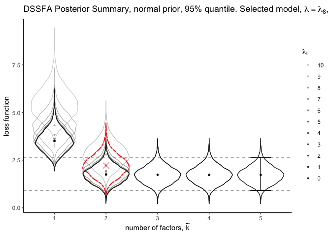

# Tutorial DSSFA


This tutorial contains R code to perform the analysis of the simple
example in the article “Decoupling Shrinkage and Selection in Gaussian Linear Factor Analysis”. 
Here, we present the three step procedure of our
method. We recommend to execute the code below in the order in which it
is presented, but changes can be made, in the solution path length, and
in the size of the credible interval of the posterior summary.

Setup and data simulation
------------------------

Before starting the analysis, set the working directory to the location
where you saved the file containing the source codes:

-   [`DSSFA_function.R`](https://github.com/hbolfarine/dssfa/blob/master/R_codes/DSSFA_function.R)
-   [`DSSFA_summary_plot.R`](https://github.com/hbolfarine/dssfa/blob/master/R_codes/DSSFA_summary_plot.R)
-   [`DSSFA_sel_mat.R`](https://github.com/hbolfarine/dssfa/blob/master/R_codes/DSSFA_sel_mat.R)

We also made available the Gibbs sampler for the Unconstrained factor
model in Rcpp, [`EFA_unconstrained.cpp`](https://github.com/hbolfarine/dssfa/blob/master/codes_toy_example/EFA_unconstrained.cpp), from the supplementary
material of e [Man & Culpepper,
2020](https://www.tandfonline.com/doi/full/10.1080/01621459.2020.1773833).
Once this has been done, load the indicated useful R packages.

```r
rm(list=ls())

# Usefull Libraries 
library(Rcpp)
library(inline)
library(fanc) 
library(tidyr)
library(dplyr)
library(RColorBrewer)
library(latex2exp)
library(ggplot2)
library(reshape2)
# devtools::install_github("thomasp85/patchwork")
library(patchwork)

source("DSSFA_function.R") # DSSFA function 
source("DSSFA_summary_plot.R") # DSSFA summary plots
source("DSSFA_sel_mat.R") # Select DSSFA point estimates given credible interval/ make plots
sourceCpp("EFA_unconstrained.cpp") # Unconstrained prior, (Man & Culpepper, 2020)
```

Generate data
-------------

Before starting the analysis, we generate data using a known loadings
matrix **β**<sub>0</sub> extracted from a factor model from [Modern
Factor Analysis, third edition, Harman
1976](https://books.google.com/books/about/Modern_Factor_Analysis.html?id=e-vMN68C3M4C).
Originally, the loadings came from the analysis of *p* = 8 physical
variables from 305 individuals, in which *k*<sub>0</sub> = 2 factors
were identified as relevant. We draw *n* = 100 samples from the FA model
**y** = **F** **β**<sub>0</sub><sup>*T*</sup> + **E**, with the uniqueness generated as
**Σ**<sub>0</sub> = diag(**I**<sub>*p*</sub> − **β**<sub>0</sub>**β**<sub>0</sub><sup>*T*</sup>).

```r
set.seed(12345)

# Number of samples.
n = 100

# Factors extracted form Harman, eight physical variables, varimax rotation.
beta.v1 = c(0.879,0.919,0.890,0.858,0.238,0.183,0.135,0.250)
beta.v2 = c(0.272,0.210,0.182,0.246,0.900,0.792,0.729,0.684)

# Number of variables.
p = 8

# Tre number of factors
k.0 = 2

# True loadings matrix.
beta.0 = matrix(c(beta.v1,beta.v2),p,k.0)

# True uniqueness.
Sigma.0 = diag(1-diag(beta.0%*%t(beta.0)))

# Latent factors.
f = matrix(rnorm((n)*k.0),n,k.0)
E = matrix(rnorm((n)*p),n,p)%*%sqrt(Sigma.0)
y = f%*%t(beta.0) + E

# Scale simulated data.
y = apply(y,2,scale)
```

Step 1. Inference
-----------------

We fit the model with independent normal priors for the loadings, and
inverse gamma for the uniqueness, with the number of factors set as
*k*<sub>max</sub> = 5. For details on the implementation and
specification see [Man & Culpepper,
2020](https://www.tandfonline.com/doi/full/10.1080/01621459.2020.1773833),
and the Supplementary Material of our paper. We ran the Gibbs sampler
for 10,000 iterations discarding the first 5,000 as burn-in. We recall
that other priors could be used in this step.
```r
# Conservative factor dimension.
kmax = 5

# Total number of iterations.
alg_iter = 10000

# Burn in.
alg_burn_in = 5000

# Gibbs sampling for the Unconstrained prior.
out = EFA_unconstrained(y, kmax, 1, 1, alg_burn_in, alg_iter)
```
From the posterior samples obtained by the Gibbs sampler, we create an
object used in the optimization step. This object contains the number of
variables, posterior loadings, posterior uniqueness, prior choice, the
final number of simulations, and thinning.
```r

# Create a new list.
obj = list()

# Number of variables in the sample.
obj$P = p

# Posterior Loadings.
obj$post.loadings = out$LAMBDA

# Posterior uniqueness. 
obj$post.sigma2 = t(out$PSIs)

# Prior information.
obj$prior.bfa = "normal"

# Posterior sample size.
obj$nsim = alg_iter-alg_burn_in

# Thinning,
obj$thin = 1
```
Step 2. Optimization - point estimates
--------------------------------------

We select a solution path of size
*λ* = *λ*<sub>0</sub>, *λ*<sub>1</sub>, …, *λ*<sub>10</sub>, for each
factor dimension. In the optimization step, and set
*k*<sub>dssfa</sub> = *k*<sub>max</sub>.
```r
# Size of the solution path 
lambda.length = 11

# DSSFA 
obj.bfa.list = dssfa(obj, kdssfa = kmax, lambda.length, print.out = T)

## Factor =  1
## Factor =  2
## Factor =  3
## Factor =  4
## Factor =  5
```
Step 3. Posterior Summary
-------------------------

We choose the size of the credible interval to be 95%. Although other choices are
possible. Next we apply the object `obj.bfa.list` with the point
estimates which yield the summary plots.
```r
# Credible interval for the dssfa method:
CI = list()
CI$CI.85 = list(c("85"),c(0.075,0.925))
CI$CI.90 = list(c("90"),c(0.05,0.95)) 
CI$CI.95 = list(c("95"),c(0.025,0.975)) # Credible interval used in the example
CI$CI.99 = list(c("99"),c(0.005,0.995))

# Summary plots.
summary.plot.dssfa(obj.bfa.list,CI[[3]], text_main_prior = "normal prior,", col.lambda = 1)
```
<p align="center">

</p>
The Figure above displays the DSSFA posterior summary plot, with the
indicated 95% credible interval of the loss of the full model. We can
observe the deterioration in utility represented by the increasing value
of the loss function in relation to λ and k. Next, we have the plots
for the model with the greatest loss inside the 95% credible interval, 
β<sub>λ<sub>8</sub></sub><sup>2</sup>, and the two factor model
with no regularization.

```r
# Select the model which yields the highest loss inside the credible interval.
model.sel = sel.model.dssfa(obj.bfa.list,CI[[3]])

# Yielded number of factors.
sel = min(which(lapply(model.sel$mat.sel.ksel,is.null) == F))
sel

## [1] 2

# Loadings from the selected model
beta.sel = model.sel$mat.sel.ksel[[sel]]
p1 = make.plot.mat(beta.sel,col.names = 1:dim(beta.sel)[1],fact.name = c("F1","F2"))

# Loadings from the two factor model with no regularization.
lamb.max = dim(obj.bfa.list$list.sel[[sel]])[3]
beta.max = obj.bfa.list$list.sel[[sel]][,,lamb.max]
p2 = make.plot.mat(beta.max,col.names = 1:dim(beta.max)[1],fact.name = c("F1","F2"))

# Plot p1 and p2 with patchwork,
p1+p2
```
<p align="center">

</p>

>Please refer to Subsection 2.5 of the paper for detailed comments on these results.
